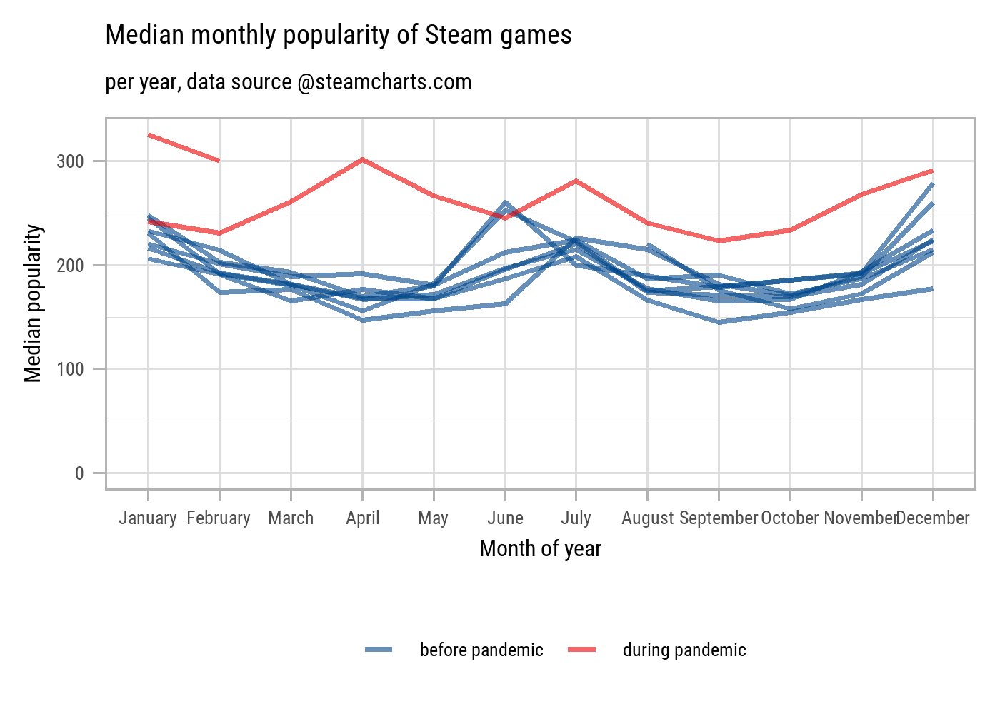

Populatity of Steam Video Games
================
Stephan
Apr 24, 2021

### Exploration of Video game popularity on steam during the pandemic

### Load the weekly Data

Download the weekly data and pre process.

``` r
games <- read_csv('https://raw.githubusercontent.com/rfordatascience/tidytuesday/master/data/2021/2021-03-16/games.csv') %>%
  mutate(avg_peak_perc = parse_number(avg_peak_perc) / 100) %>%
  mutate(date = ymd(paste(year, month, 1))) %>%
  filter(date > min(date)) %>%
  mutate(month = fct_reorder(month, month(date)))
```

### Visual Exploration

``` r
games %>%
  group_by(year, month) %>%
  summarize(median_avg = median(avg),
            median_peak = median(peak)) %>%
  ungroup() %>% 
  mutate(ind = ifelse(year == 2020 | year == 2021, "during pandemic", "before pandemic")) %>% 
  ggplot() +
  geom_line(aes(month, median_avg, color = ind, group = year), size = 1.3, alpha = 0.6) +
  ggsci::scale_color_lancet() +
  expand_limits(y = 0) +
  labs(x = "Month of year",
       y = "Median popularity",
       title = "Median monthly popularity of Steam games",
       subtitle = "per year, data source @steamcharts.com",
       color = NULL) +
  theme(legend.position="bottom") 
```

<!-- -->
